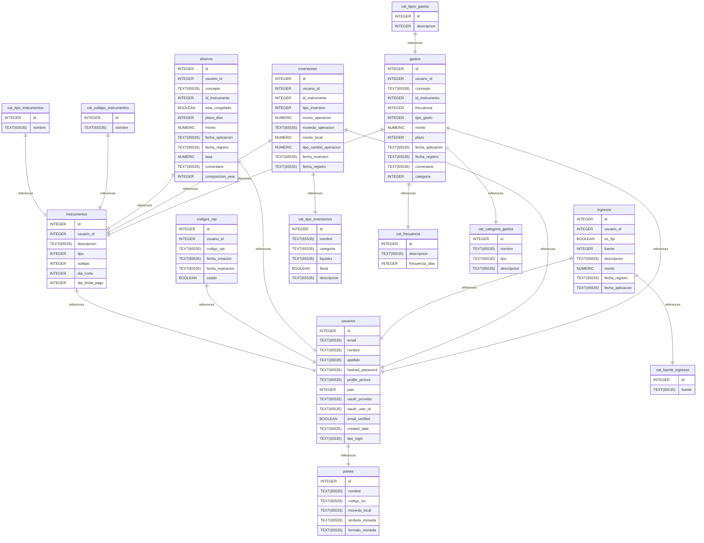

# dinex_db_schema documentation
## Summary

- [Introduction](#introduction)
- [Database Type](#database-type)
- [Table Structure](#table-structure)
	- [gastos](#gastos)
	- [usuarios](#usuarios)
	- [instrumentos](#instrumentos)
	- [codigos_otp](#codigos_otp)
	- [cat_tipo_instrumentos](#cat_tipo_instrumentos)
	- [cat_subtipo_instrumentos](#cat_subtipo_instrumentos)
	- [ahorros](#ahorros)
	- [cat_tipos_gastos](#cat_tipos_gastos)
	- [ingresos](#ingresos)
	- [cat_fuente_ingresos](#cat_fuente_ingresos)
	- [inversiones](#inversiones)
	- [cat_tipo_inversiones](#cat_tipo_inversiones)
	- [cat_frecuencia](#cat_frecuencia)
	- [paises](#paises)
	- [cat_categoria_gastos](#cat_categoria_gastos)
- [Relationships](#relationships)
- [Database Diagram](#database-diagram)

## Introduction

## Database type

- **Database system:** SQLite
## Table structure

### gastos

| Name        | Type          | Settings                      | References                    | Note                           |
|-------------|---------------|-------------------------------|-------------------------------|--------------------------------|
| **id** | INTEGER | 🔑 PK, not null, unique, autoincrement |  | |
| **usuario_id** | INTEGER | null | fk_gastos_usuario_id_usuarios | |
| **concepto** | TEXT(65535) | not null |  | |
| **id_instrumento** | INTEGER | not null | fk_gastos_id_instrumento_instrumentos | |
| **frecuencia** | INTEGER | not null | fk_gastos_categoria_cat_frecuencia | |
| **tipo_gasto** | INTEGER | null |  | |
| **monto** | NUMERIC | not null |  | |
| **plazo** | INTEGER | null, default: 0 |  | |
| **fecha_aplicacion** | TEXT(65535) | null |  | |
| **fecha_registro** | TEXT(65535) | null |  | |
| **comentario** | TEXT(65535) | null, default: '' |  | |
| **categoria** | INTEGER | null | fk_gastos_categoria_cat_categoria_gastos | | 

### usuarios

| Name        | Type          | Settings                      | References                    | Note                           |
|-------------|---------------|-------------------------------|-------------------------------|--------------------------------|
| **id** | INTEGER | 🔑 PK, not null, unique, autoincrement |  | |
| **email** | TEXT(65535) | not null, unique |  | |
| **nombre** | TEXT(65535) | not null |  | |
| **apellido** | TEXT(65535) | not null |  | |
| **hashed_password** | TEXT(65535) | not null, default: '' |  | |
| **profile_picture** | TEXT(65535) | not null, default: '' |  | |
| **pais** | INTEGER | not null | fk_usuarios_pais_paises | |
| **oauth_provider** | TEXT(65535) | not null, default: '' |  | |
| **oauth_user_id** | TEXT(65535) | not null, default: '' |  | |
| **email_verified** | BOOLEAN | not null |  | |
| **created_date** | TEXT(65535) | not null |  | |
| **last_login** | TEXT(65535) | not null |  | | 

#### Indexes
| Name | Unique | Fields |
|------|--------|--------|
| usuarios_index_0 |  | email |
### instrumentos

| Name        | Type          | Settings                      | References                    | Note                           |
|-------------|---------------|-------------------------------|-------------------------------|--------------------------------|
| **id** | INTEGER | 🔑 PK, not null, unique, autoincrement |  | |
| **usuario_id** | INTEGER | not null | fk_instrumentos_usuario_id_usuarios | |
| **descripcion** | TEXT(65535) | not null |  | |
| **tipo** | INTEGER | not null |  | |
| **subtipo** | INTEGER | not null |  | |
| **dia_corte** | INTEGER | not null |  | |
| **dia_limite_pago** | INTEGER | not null |  | | 

### codigos_otp

| Name        | Type          | Settings                      | References                    | Note                           |
|-------------|---------------|-------------------------------|-------------------------------|--------------------------------|
| **id** | INTEGER | 🔑 PK, not null, unique, autoincrement |  | |
| **usuario_id** | INTEGER | not null | fk_codigos_otp_usuario_id_usuarios | |
| **codigo_opt** | TEXT(65535) | not null |  | |
| **fecha_creacion** | TEXT(65535) | not null, default: (CURRENT_TIMESTAMP) |  | |
| **fecha_expiracion** | TEXT(65535) | not null |  | |
| **usado** | BOOLEAN | not null, default: false |  | | 

### cat_tipo_instrumentos

| Name        | Type          | Settings                      | References                    | Note                           |
|-------------|---------------|-------------------------------|-------------------------------|--------------------------------|
| **id** | INTEGER | 🔑 PK, not null, unique, autoincrement | fk_cat_tipos_instrumentos_id_instrumentos | |
| **nombre** | TEXT(65535) | not null |  | | 

### cat_subtipo_instrumentos

| Name        | Type          | Settings                      | References                    | Note                           |
|-------------|---------------|-------------------------------|-------------------------------|--------------------------------|
| **id** | INTEGER | 🔑 PK, not null, unique, autoincrement | fk_cat_subtipos_instrumentos_id_instrumentos | |
| **nombre** | TEXT(65535) | not null |  | | 

### ahorros

| Name        | Type          | Settings                      | References                    | Note                           |
|-------------|---------------|-------------------------------|-------------------------------|--------------------------------|
| **id** | INTEGER | 🔑 PK, not null, unique, autoincrement |  | |
| **usuario_id** | INTEGER | not null | fk_ahorros_usuario_id_usuarios | |
| **concepto** | TEXT(65535) | not null |  | |
| **id_instrumento** | INTEGER | not null | fk_ahorros_id_instrumento_instrumentos | |
| **esta_congelado** | BOOLEAN | null, default: false |  | |
| **plazo_dias** | INTEGER | not null |  | |
| **monto** | NUMERIC | not null |  | |
| **fecha_aplicacion** | TEXT(65535) | not null |  | |
| **fecha_registro** | TEXT(65535) | not null |  | |
| **tasa** | NUMERIC | not null |  | |
| **comentario** | TEXT(65535) | null, default: '' |  | |
| **composicion_year** | INTEGER | null, default: 360 |  | | 

### cat_tipos_gastos

| Name        | Type          | Settings                      | References                    | Note                           |
|-------------|---------------|-------------------------------|-------------------------------|--------------------------------|
| **id** | INTEGER | 🔑 PK, not null, unique, autoincrement | fk_cat_tipos_gastos_id_gastos | |
| **descripcion** | INTEGER | null |  | | 

### ingresos

| Name        | Type          | Settings                      | References                    | Note                           |
|-------------|---------------|-------------------------------|-------------------------------|--------------------------------|
| **id** | INTEGER | 🔑 PK, not null, unique, autoincrement |  | |
| **usuario_id** | INTEGER | not null | fk_ingresos_usuario_id_usuarios | |
| **es_fijo** | BOOLEAN | not null, default: true |  | |
| **fuente** | INTEGER | not null | fk_ingresos_fuente_cat_fuente_ingresos | |
| **descripcion** | TEXT(65535) | null |  | |
| **monto** | NUMERIC | not null |  | |
| **fecha_registro** | TEXT(65535) | null |  | |
| **fecha_aplicacion** | TEXT(65535) | null |  | | 

### cat_fuente_ingresos

| Name        | Type          | Settings                      | References                    | Note                           |
|-------------|---------------|-------------------------------|-------------------------------|--------------------------------|
| **id** | INTEGER | 🔑 PK, not null, unique, autoincrement |  | |
| **fuente** | TEXT(65535) | null |  | | 

### inversiones

| Name        | Type          | Settings                      | References                    | Note                           |
|-------------|---------------|-------------------------------|-------------------------------|--------------------------------|
| **id** | INTEGER | 🔑 PK, not null, unique, autoincrement |  | |
| **usuario_id** | INTEGER | null | fk_inversiones_usuario_id_usuarios | |
| **id_instrumento** | INTEGER | null | fk_inversiones_id_instrumento_instrumentos | |
| **tipo_inversion** | INTEGER | null | fk_inversiones_tipo_inversion_cat_tipo_inversiones | |
| **monto_operacion** | NUMERIC | null |  | |
| **moneda_operacion** | TEXT(65535) | null |  | |
| **monto_local** | NUMERIC | null |  | |
| **tipo_cambio_operacion** | NUMERIC | null |  | |
| **fecha_inversion** | TEXT(65535) | null |  | |
| **fecha_registro** | TEXT(65535) | null |  | | 

### cat_tipo_inversiones

| Name        | Type          | Settings                      | References                    | Note                           |
|-------------|---------------|-------------------------------|-------------------------------|--------------------------------|
| **id** | INTEGER | 🔑 PK, not null, unique, autoincrement |  | |
| **nombre** | TEXT(65535) | not null |  | |
| **categoria** | TEXT(65535) | not null |  | |
| **liquidez** | TEXT(65535) | not null |  | |
| **fiscal** | BOOLEAN | not null, default: true |  | |
| **descripcion** | TEXT(65535) | not null |  | | 

### cat_frecuencia

| Name        | Type          | Settings                      | References                    | Note                           |
|-------------|---------------|-------------------------------|-------------------------------|--------------------------------|
| **id** | INTEGER | 🔑 PK, not null, unique, autoincrement |  | |
| **descripcion** | TEXT(65535) | null |  | |
| **frecuencia_dias** | INTEGER | null |  | | 

### paises

| Name        | Type          | Settings                      | References                    | Note                           |
|-------------|---------------|-------------------------------|-------------------------------|--------------------------------|
| **id** | INTEGER | 🔑 PK, not null, unique, autoincrement |  | |
| **nombre** | TEXT(65535) | null |  | |
| **codigo_iso** | TEXT(65535) | null |  | |
| **moneda_local** | TEXT(65535) | null |  | |
| **simbolo_moneda** | TEXT(65535) | null |  | |
| **formato_moneda** | TEXT(65535) | null |  | | 

### cat_categoria_gastos

| Name        | Type          | Settings                      | References                    | Note                           |
|-------------|---------------|-------------------------------|-------------------------------|--------------------------------|
| **id** | INTEGER | 🔑 PK, not null, unique, autoincrement |  | |
| **nombre** | TEXT(65535) | null |  | |
| **tipo** | TEXT(65535) | null |  | |
| **descripcion** | TEXT(65535) | null |  | | 

## Relationships

- **instrumentos to usuarios**: one_to_one
- **codigos_otp to usuarios**: one_to_one
- **cat_tipo_instrumentos to instrumentos**: one_to_one
- **cat_subtipo_instrumentos to instrumentos**: one_to_one
- **ahorros to usuarios**: one_to_one
- **ahorros to instrumentos**: one_to_one
- **cat_tipos_gastos to gastos**: one_to_one
- **ingresos to usuarios**: one_to_one
- **ingresos to cat_fuente_ingresos**: one_to_one
- **inversiones to cat_tipo_inversiones**: one_to_one
- **usuarios to paises**: one_to_one
- **gastos to cat_frecuencia**: one_to_one
- **gastos to cat_categoria_gastos**: one_to_one
- **inversiones to usuarios**: one_to_one
- **inversiones to instrumentos**: one_to_one
- **gastos to usuarios**: one_to_one
- **gastos to instrumentos**: one_to_one

## Database Diagram

